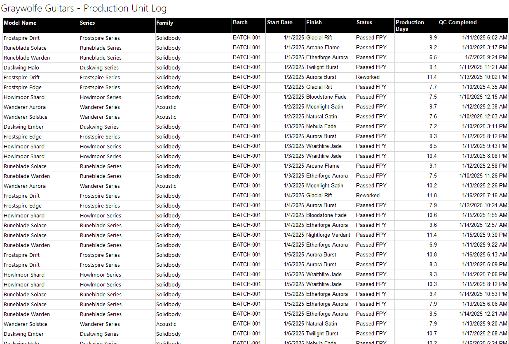
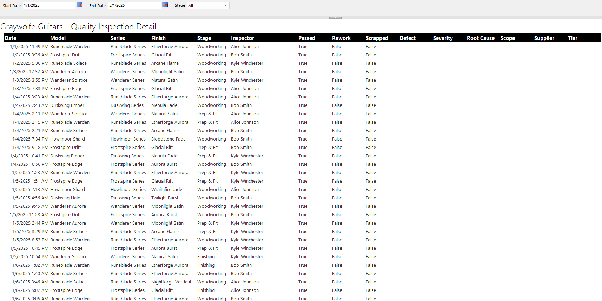
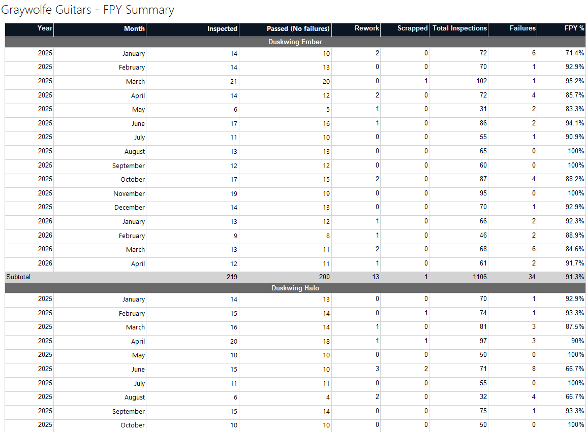

# Manufacturing FPY Dashboard (Power BI)

## Overview

This project simulates a manufacturing analytics scenario for a fictional guitar company and demonstrates how production data can be transformed into clear, decision-oriented insight.

**Core question:**
Where is yield loss occurring, and what process changes would have the greatest impact?

---

## Key Insights (Default filtering: all Families, Lines, and Models)

- FPY: 90.2% (below target)
- Failures are concentrated in the **Finishing** stage
- Top defect: **Glue curing error**
- Majority of issues are **internal (60.6%)**

**Conclusion:**  
Yield loss is driven primarily by internal process issues within a specific stage, indicating that improvements in process control would have the greatest impact.

---

## Dashboard Preview

### Default View

### "Finishing" Stage Selected in chart (updates Top 5 defects, Root Cause Category, and Top 5 Suppliers visuals)

### Filtered Example (Duskwind Series - updates "filtered" text in the header, the KPI row, and all visuals)

### Slicer Panel

### Tooltip Example

---

## Tools Used

- Power BI: star schema data modeling, DAX measures, conditional formatting, custom tooltip pages
- Python: synthetic data generation
  - Pandas: DataFrame construction and CSV output across 9 structured files
  - uuid, random, dateutil: unit ID generation, seeded randomization, and date arithmetic

---

## Paginated Reports (Power BI Report Builder)

In addition to the interactive dashboard, this project includes a set of paginated 
reports built in Power BI Report Builder, using the same underlying SQL Server dataset. 
These demonstrate the .rdl format used by both Report Builder and SSRS.

### Report 1: Production Unit Log
A tabular log of all production units with model, batch, finish, status, and total production days.

### Report 2: Inspection Detail (Parameterized)
Filterable by date range and production stage. Date range defaults are pulled dynamically
from the database rather than hard-coded.

### Report 3: FPY Summary by Model and Month
Grouped by model with per-model subtotals and a grand total. FPY % is calculated at
both the monthly detail level and the subtotal/grand total level.

### Report Builder concepts demonstrated
- Embedded data sources and datasets with multi-table JOIN queries
- Query-driven parameter defaults (dynamic min/max date from the database)
- Dropdown parameters with static available values
- Row grouping with merged group header rows and subtotal footers
- Calculated expressions for FPY % at both detail and aggregate levels
- CTE-based queries to support clean unit-level aggregation

---

## Approach

 - Generated 2,000+ production unit rows and 11,000+ inspection rows across 9 CSV files simulating 14 months of guitar manufacturing operations
 - Modeled 45 defect types and 35 root causes with stage-aware selection logic, preventing defects from appearing at production stages where they couldn't realistically be detected
 - Applied weighted root cause attribution per defect, distinguishing supplier-driven, internal, and shared responsibility
 - Calibrated scrap probabilities per defect type, ranging from near-certain scrap for structural wood failures to rare scrap for finish and process defects
 - Modeled relationships between stages, defects, and root causes in Power BI
 - Built DAX measures for FPY and failure distribution
 - Designed a single-page dashboard focused on clarity and decision support

---

## Potential Extensions/Next Steps

- Time-series / Process stability analysis
  - Control charts (p-charts) to monitor FPY and defect rates over time
  - Add rolling averages to KPIs
- Dedicated drill-through pages for:
  - Stage deep-dive
  - Supplier performance profiles
  - Operator-Level insights
- Build a Recommendation / What-if Layer
  - Extend the data model to simulate improvement scenarios
    - _If [Glue curing errors] is reduced [15%], expected FPY impact is x._
- Cost of Poor Quality (COPQ) Analysis
  - Scrap cost (material loss)
  - Rework labor cost
  - Top cost drivers (also factored into the main page's insight text and improvement scenario calculations)
