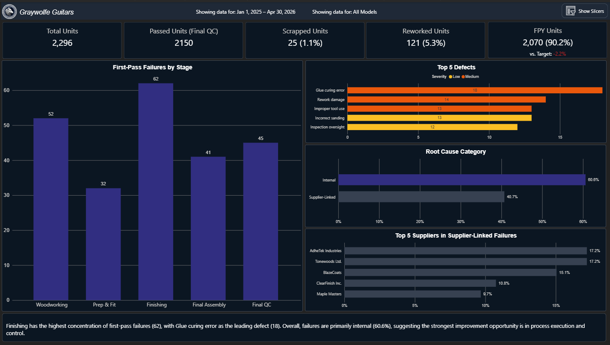
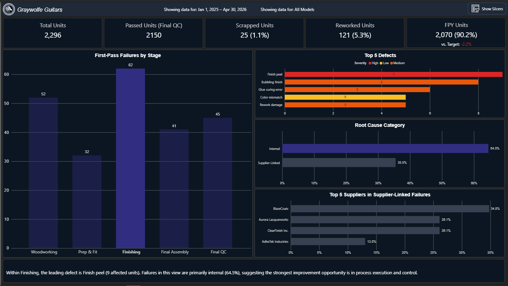
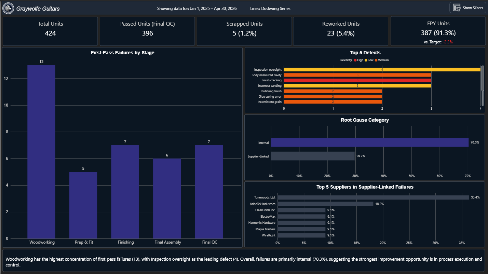
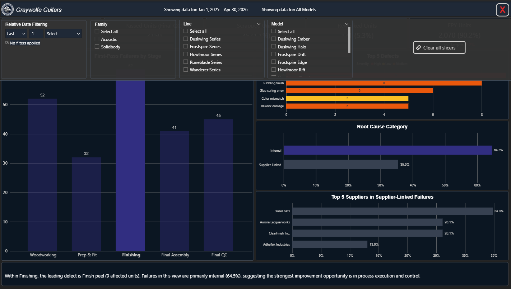
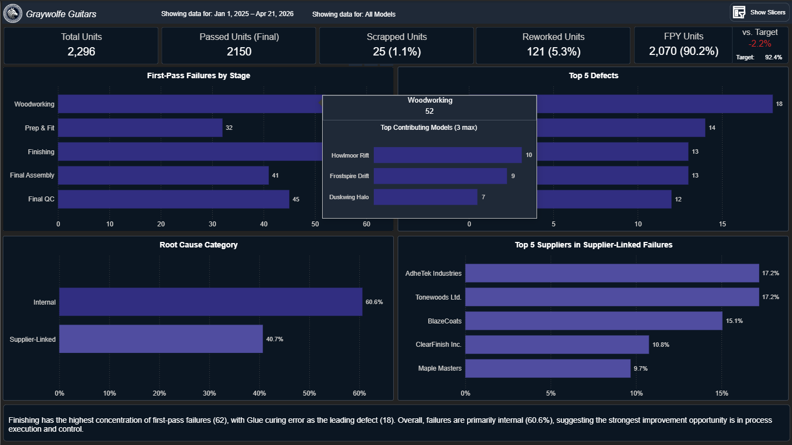

# Manufacturing FPY Dashboard (Power BI)

## Overview

This project simulates a manufacturing analytics scenario for a fictional guitar company and demonstrates how production data can be transformed into clear, decision-oriented insight.

**Core question:**
Where are we losing yield, why is it happening, and where should improvement efforts be focused?

---

## Key Insights (Default filtering: all Families, Lines, and Models)

- FPY: 90.2% (below target)
- Failures are concentrated in the **Finishing** stage
- Top defect: **Glue curing error**
- Majority of issues are **internal (60.6%)**

**Conclusion:**  
Yield loss is driven primarily by internal process issues within a specific stage, indicating that improvements in process control would have the greatest impact.

---

## Dashboard Preview

### Default View

### "Finishing" Stage Selected in chart

### Filtered Example (Duskwind Series)

### Slicer Panel

### Tooltip Example

---

## Tools Used

- Power BI (data modeling, DAX, visualization)
- Python (data generation)
- Pandas (data preparation)

---

## Approach

- Created a structured dataset simulating production units and defects
- Modeled relationships between stages, defects, and root causes
- Built DAX measures for FPY and failure distribution
- Designed a single-page dashboard focused on clarity and decision support

---

## Full Project Write-Up

For a detailed breakdown of the business problem, methodology, and recommendations:

👉 [View Full Project Details](project_details.md)
